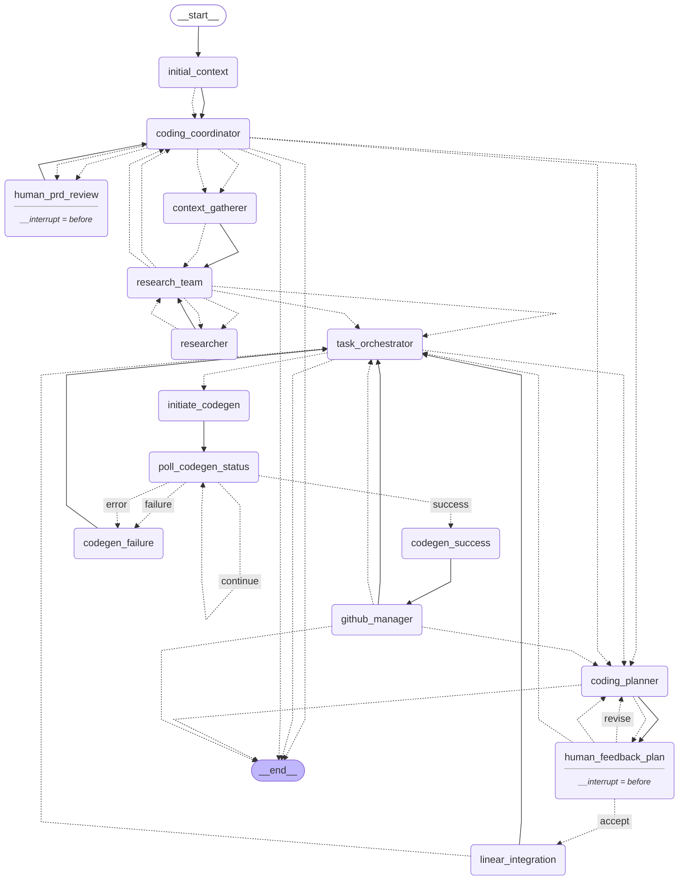

```mermaid
---
config:
  flowchart:
    curve: linear
---
graph TD;
	__start__([<p>__start__</p>]):::first
	initial_context(initial_context)
	coding_coordinator(coding_coordinator)
	human_prd_review(human_prd_review<hr/><small><em>__interrupt = before</em></small>)
	context_gatherer(context_gatherer)
	research_team(research_team)
	researcher(researcher)
	coding_planner(coding_planner)
	human_feedback_plan(human_feedback_plan<hr/><small><em>__interrupt = before</em></small>)
	linear_integration(linear_integration)
	task_orchestrator(task_orchestrator)
	initiate_codegen(initiate_codegen)
	poll_codegen_status(poll_codegen_status)
	codegen_success(codegen_success)
	codegen_failure(codegen_failure)
	github_manager(github_manager)
	__end__([<p>__end__</p>]):::last
	__start__ --> initial_context;
	codegen_failure --> task_orchestrator;
	codegen_success --> github_manager;
	coding_planner --> human_feedback_plan;
	context_gatherer --> research_team;
	github_manager --> task_orchestrator;
	human_prd_review --> coding_coordinator;
	initial_context --> coding_coordinator;
	initiate_codegen --> poll_codegen_status;
	linear_integration --> task_orchestrator;
	researcher --> research_team;
	coding_coordinator -.-> human_prd_review;
	coding_coordinator -.-> context_gatherer;
	coding_coordinator -.-> coding_planner;
	coding_coordinator -.-> __end__;
	research_team -.-> researcher;
	research_team -.-> task_orchestrator;
	research_team -.-> coding_coordinator;
	human_feedback_plan -. &nbsp;revise&nbsp; .-> coding_planner;
	human_feedback_plan -. &nbsp;accept&nbsp; .-> linear_integration;
	task_orchestrator -.-> initiate_codegen;
	task_orchestrator -.-> coding_planner;
	task_orchestrator -.-> __end__;
	poll_codegen_status -. &nbsp;success&nbsp; .-> codegen_success;
	poll_codegen_status -. &nbsp;failure&nbsp; .-> codegen_failure;
	poll_codegen_status -. &nbsp;error&nbsp; .-> codegen_failure;
	initial_context -.-> coding_coordinator;
	coding_coordinator -.-> human_prd_review;
	coding_coordinator -.-> context_gatherer;
	coding_coordinator -.-> coding_planner;
	coding_coordinator -.-> __end__;
	context_gatherer -.-> research_team;
	research_team -.-> researcher;
	research_team -.-> task_orchestrator;
	research_team -.-> coding_coordinator;
	researcher -.-> research_team;
	coding_planner -.-> human_feedback_plan;
	coding_planner -.-> __end__;
	human_feedback_plan -.-> coding_planner;
	human_feedback_plan -.-> task_orchestrator;
	linear_integration -.-> task_orchestrator;
	github_manager -.-> task_orchestrator;
	github_manager -.-> coding_planner;
	github_manager -.-> __end__;
	poll_codegen_status -. &nbsp;continue&nbsp; .-> poll_codegen_status;
	classDef default fill:#f2f0ff,line-height:1.2
	classDef first fill-opacity:0
	classDef last fill:#bfb6fc

```