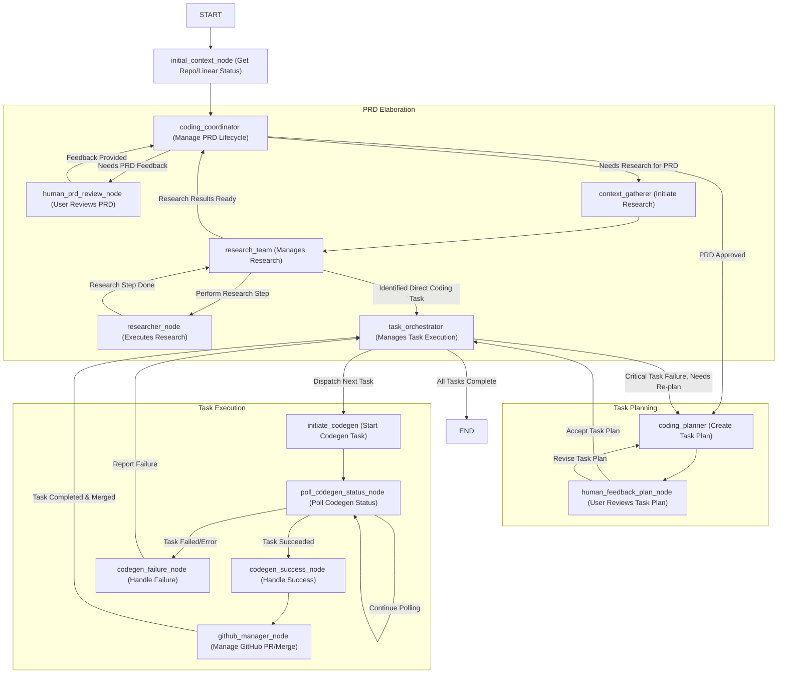

```mermaid
graph TD
    START --> initial_context_node["initial_context_node (Get Repo/Linear Status)"];
    initial_context_node --> coding_coordinator["coding_coordinator (Manage PRD Lifecycle)"];

    subgraph PRD Elaboration
        direction LR
        coding_coordinator -- "Needs PRD Feedback" --> human_prd_review_node["human_prd_review_node (User Reviews PRD)"];
        human_prd_review_node -- "Feedback Provided" --> coding_coordinator;

        coding_coordinator -- "Needs Research for PRD" --> context_gatherer["context_gatherer (Initiate Research)"];
        context_gatherer --> research_team["research_team (Manages Research)"];
        research_team -- "Perform Research Step" --> researcher_node["researcher_node (Executes Research)"];
        researcher_node -- "Research Step Done" --> research_team;
        research_team -- "Research Results Ready" --> coding_coordinator;
        research_team -- "Identified Direct Coding Task" --> task_orchestrator;
    end

    coding_coordinator -- "PRD Approved" --> coding_planner["coding_planner (Create Task Plan)"];

    subgraph Task Planning
        direction LR
        coding_planner --> human_feedback_plan_node["human_feedback_plan_node (User Reviews Task Plan)"];
        human_feedback_plan_node -- "Accept Task Plan" --> task_orchestrator;
        human_feedback_plan_node -- "Revise Task Plan" --> coding_planner;
    end
    
    task_orchestrator["task_orchestrator (Manages Task Execution)"];

    subgraph Task Execution
        direction LR
        task_orchestrator -- "Dispatch Next Task" --> initiate_codegen["initiate_codegen (Start Codegen Task)"];
        initiate_codegen --> poll_codegen_status_node["poll_codegen_status_node (Poll Codegen Status)"];
        poll_codegen_status_node -- "Continue Polling" --> poll_codegen_status_node;
        poll_codegen_status_node -- "Task Succeeded" --> codegen_success_node["codegen_success_node (Handle Success)"];
        poll_codegen_status_node -- "Task Failed/Error" --> codegen_failure_node["codegen_failure_node (Handle Failure)"];

        codegen_success_node --> github_manager_node["github_manager_node (Manage GitHub PR/Merge)"];
        github_manager_node -- "Task Completed & Merged" --> task_orchestrator;
        
        codegen_failure_node -- "Report Failure" --> task_orchestrator;
    end

    task_orchestrator -- "Critical Task Failure, Needs Re-plan" --> coding_planner;
    task_orchestrator -- "All Tasks Complete" --> END;
``` 